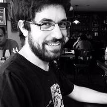
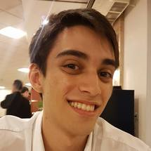
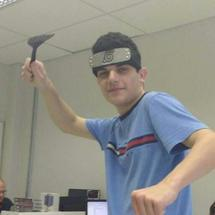
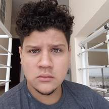
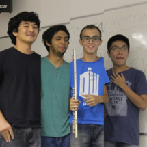
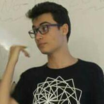
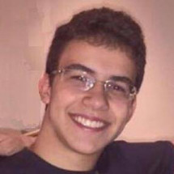
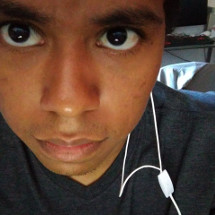

## Base Development team

<h1>Henrique Alves</h1>
Project Coordinator and Godot mentor.

<h1>Thiago Amendola</h1>
Project Coordinator.

## Game Authors

<h1>Henrique</h1>
"Goats!" and "Bang!" developer.

<h1>Alec</h1>
"Simon" and "Hammer" developer.

<h1>"Peace Simulator" team</h1>
From left to right: 
Developers of "Peace Simulator".

<h1>Carlos</h1>
"Space Shooter" developer.

<h1>Gustavo</h1>
Developer of Super Tank.

<h1>Arthur</h1>
Creator of "Don't move", and artist of other minigames.

[back](./)
