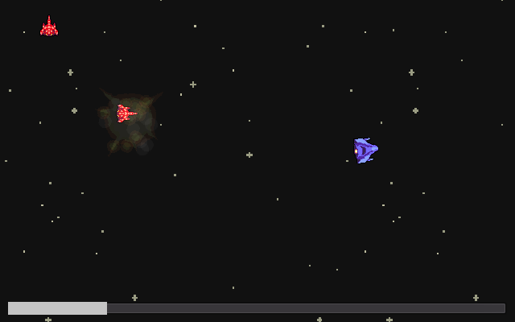

# Game list

<h2>Bang!</h2>
It's a cowboy duel; shoot him before he does!

<h2>Artick</h2>
Grab all the documents before they fall off-screen!

<h2>Don't move</h2>
Stay still and don't move your mouse!

<h2>Goats!</h2>
They are eating your crops! Shoot them with tranquilizer darts!

<h2>Hammer</h2>
Try hitting the nail with your hammer!

<h2>Peace Simulator</h2>
Survive by avoiding the agressors until the time runs out!

<h2>Simon</h2>
Do as the master says!

<h2>Space Shooter</h2>
Survive by moving your starship and shooting the enemies!

<h2>Supertank</h2>
Move the tank using the cursor while avoiding the traps!

[back](./)
